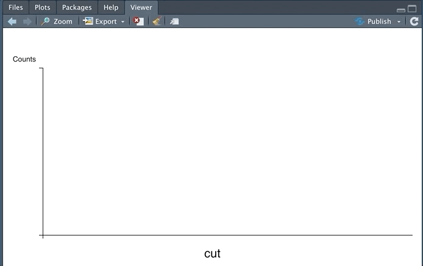

# countem

<!-- badges: start -->


<!-- badges: end -->

Sit back, relax, and enjoy the bar charts.

## Installation

You can install the released version of countem from GitHub:

``` r
remotes::install_github("daranzolin/countem")
```

## Count 'em!

countem cycles through categorical variables in a data frame and creates bar charts for each one. The diamonds dataset, for example, includes three categorical variables: clarity, color, and cut.

``` r
library(countem)
countem(ggplot2::diamonds)
```


Adjust transition speed, fill colors, and more. 
